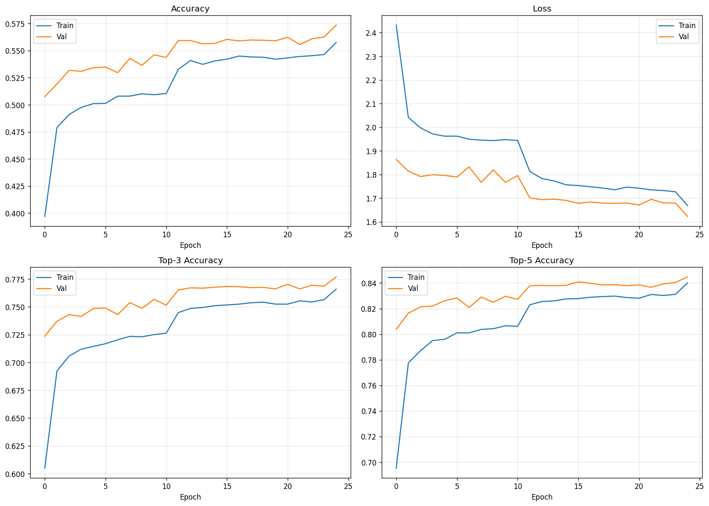
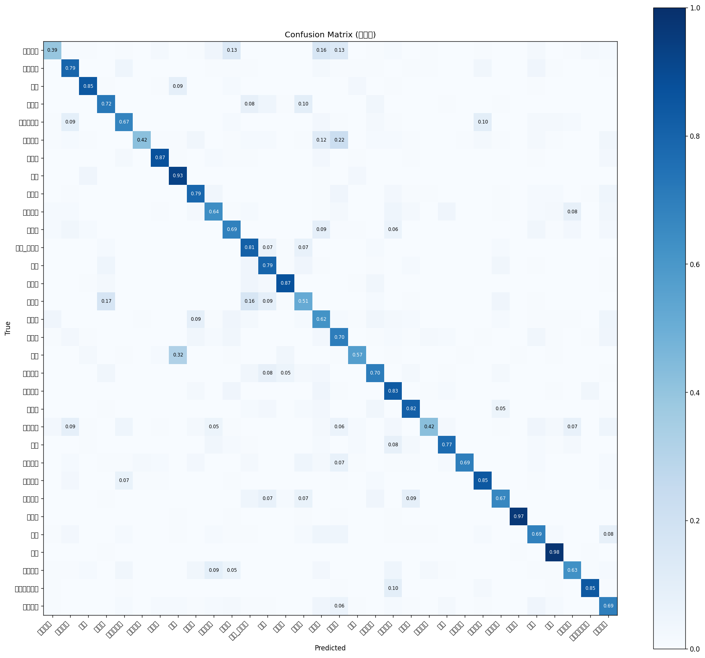

# Korean Food Classifier

AI Hub 한식 이미지 데이터셋으로 학습한 분류기. MobileNetV2 기반, 모바일 배포(TFLite)용.

## 사용법

```bash
pip install -r requirements.txt
```

### 1. 데이터 준비

AI Hub에서 받은 zip을 `data/zips/` 에 둔 다음:

```python
from data import extract_zips, flatten, split_dataset

extract_zips()      # zip → data/raw/
flatten()           # data/raw/ → data/flat/  (음식별 폴더로 평탄화)
split_dataset()     # data/flat/ → data/split/{train,val,test}/
```

### 2. 학습

```bash
python train.py
```

설정은 `config.py`에서 바꾼다. 결과는 `models/best.keras` 와 `models/history.json`.

### 3. 평가

```bash
python evaluate.py
```

테스트셋 metrics, classification report, confusion matrix 생성.

### 4. TFLite 변환

```bash
python export.py                  # dynamic (기본, 2~3MB)
python export.py --quant float16  # float16 (4MB)
python export.py --quant none     # 비양자화 (8~9MB)
```

### 5. 단일 이미지 예측

```bash
python predict.py path/to/image.jpg
```

## 구조

- `config.py` 모든 경로/하이퍼파라미터
- `data.py` zip 해제, 평탄화, split, tf.data 로더
- `model.py` 모델 정의
- `train.py` 학습 루프
- `evaluate.py` 평가 + confusion matrix
- `export.py` TFLite 변환
- `predict.py` 단일 이미지 추론
- `notebooks/colab.ipynb` Colab에서 한 번에 돌리는 노트북

## 결과 (32 클래스 기준)

| metric | value |
|---|---|
| test accuracy | 72.7% |
| top-3 accuracy | 91.1% |
| top-5 accuracy | 95.8% |
| TFLite (dynamic) | 2.43 MB |

### 학습 곡선



20 epoch 학습. Early stopping으로 epoch 17에서 best 모델 저장.
Train과 Val accuracy 차이가 작아 과적합 없음.

### Confusion Matrix



자주 혼동되는 쌍:
- 송편 ↔ 꿀떡 (둥근 떡)
- 곱창구이 ↔ 삼겹살 (양념된 고기)
- 북엇국 ↔ 계란국 (맑은 국물)
- 후라이드치킨 ↔ 양념치킨 (양념 유무)

비슷한 음식끼리의 혼동이라 모델 한계가 아니라 데이터 본질적인 어려움.

## 라이선스

AI Hub 데이터는 비상업적 연구용. 학습된 모델 배포 시 라이선스 확인 필요.
